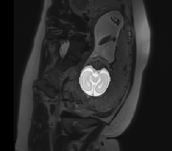

# Fetal Brain Mask

[](https://hub.docker.com/r/fnndsc/pl-fetal-brain-mask)
[](https://github.com/FNNDSC/pl-fetal-brain-mask/blob/master/LICENSE)

Automatic brain image masking tool for fetal brain MRI using deep learning.

For each `.nii` or `.nii.gz` file in a directory, a `_mask.nii` is produced.



##  Usage

Single sample

```bash
mkdir in out
mv scan.nii.gz in

docker run --rm -u $(id -u):$(id -g) \
    -v $PWD/in:/incoming:ro -v $PWD/out:/outgoing:rw  \
    fnndsc/pl-fetal-brain-mask:1.0.0 fetal_brain_mask \
    --inputPathFilter scan.nii.gz --suffix _mask.nii \
    --skipped-list skipped.txt
```

Multiple inputs are processed in parallel, using all the cores visible inside the container.
For large datasets, you can limit the number of concurrent jobs to `N` jobs with `docker run --cpuset-cpus 0-$((N-1))`

```bash
# limit to 5 concurrent jobs
docker run --rm -u $(id -u):$(id -g) --cpuset-cpus 0-4 \
    -v $PWD/in:/incoming:ro -v $PWD/out:/outgoing:rw   \
    fnndsc/pl-fetal-brain-mask:1.0.0 fetal_brain_mask  \
    --inputPathFilter scan.nii.gz --suffix _mask.nii   \
    --skipped-list skipped.txt
```

See `docker run --help` for other throttling options.

Some (not all) unnessessary tensorflow output can be silcence

```bash
docker run --rm -e TF_CPP_MIN_LOG_LEVEL=3 fnndsc/pl-fetal-brain-mask:1.0.0
```

## Links

Original source:
https://github.com/chrisorozco1097/masking_tool
